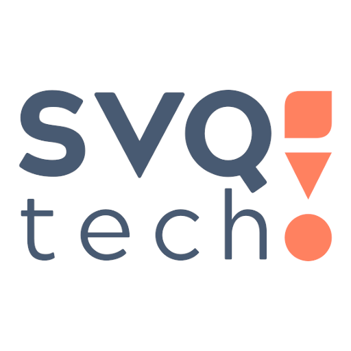

# Identidad corporativa SVQtech

## Imagotipo
### Positivo color

Versión principal del imagotipo para su uso en la mayoría de los casos

### Negativo color

Versión negativa con color para su uso en perfiles sociales y otros casos en los que se requiera diferenciar el fondo del blanco y no sea posible el uso de líneas de delimitación. Usar con el color "Gris negativo" (#38475a) como fondo.

### Positivo 1 tinta

### Negativo 1 tinta

## Colores
- Primario: #ff8160
- Secundario: #465971
- Gris negativo: #38475a
- Gradiente: #ffab60

## Tipografía
### Principal
Acherus Grotesque
### Secundaria
Roboto

